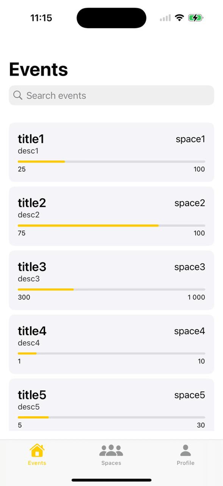
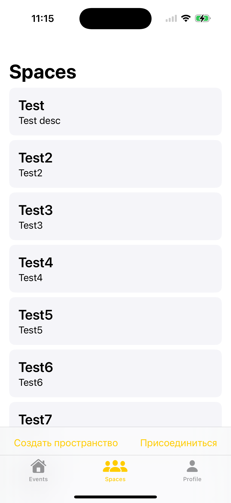
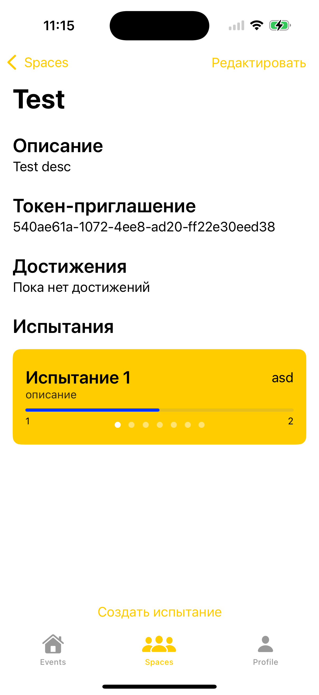
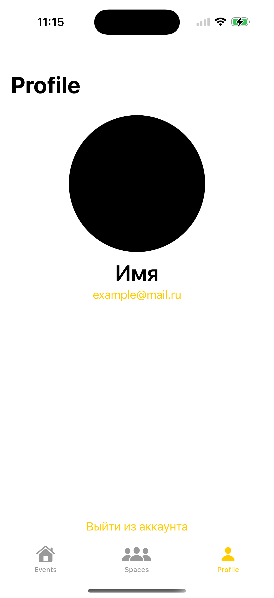

# iOS app for Oggetto

iOS приложение для создания, отслеживания, выполнения испытаний внутри групп (компания/семья/...)

# Demo

  
  
  
  

# System requirements

- iOS: 16.0+
- Swift 5
- Xcode 16+

# Project setup
